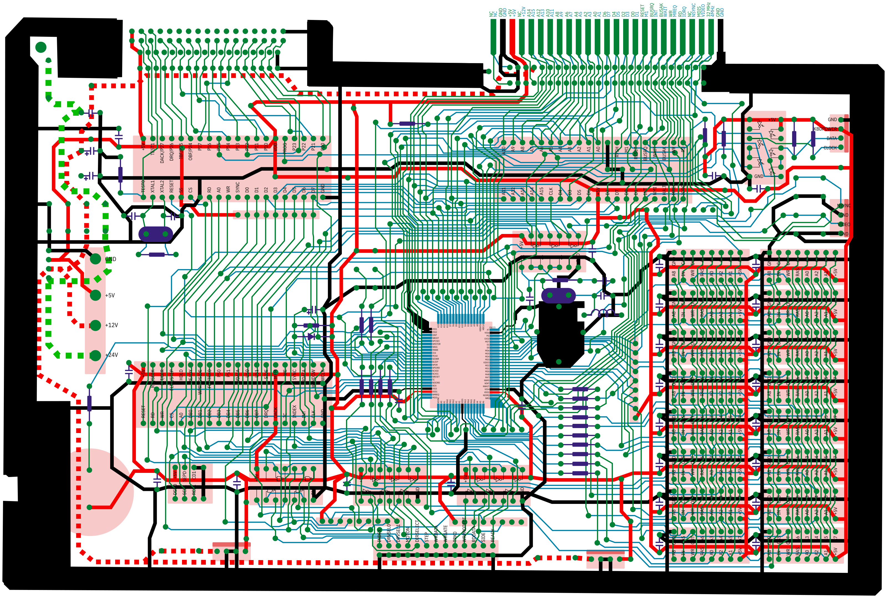
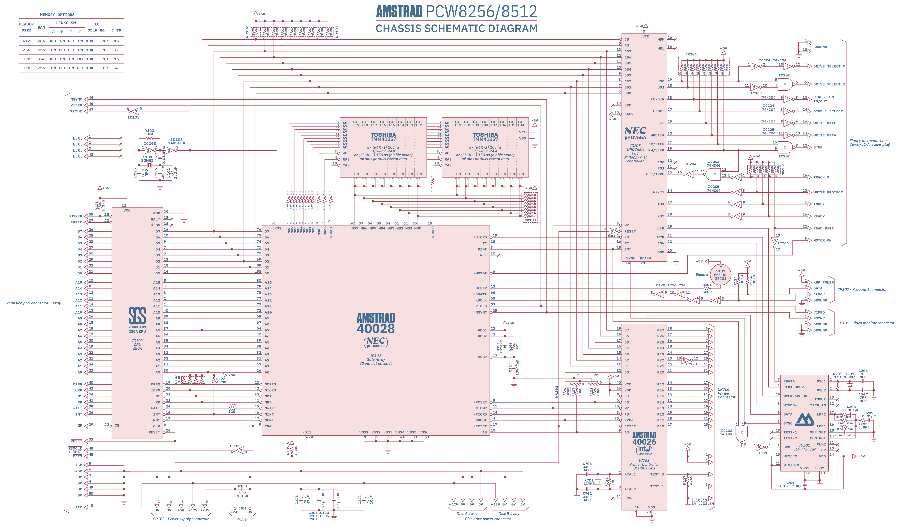

Schema
======

Here are 2 schemas.

Circuit
-------

The SVG contains several layers that allows you to analyze how the motherboard
was organized.

It is the circuit of the first motherboard version when it did not yet use the
SED9420Cac chipset.

Chassis schematic diagram
-------------------------

The chassis schematic diagram is a redraw of the original chassis schematic
diagram of the Amstrad PCW 8256/8512 motherboard.

Note: now equiped with the SED9420Cac chipset, this motherboard makes no use
of the gate array WCK pin which was used for floppy disc concerns.

