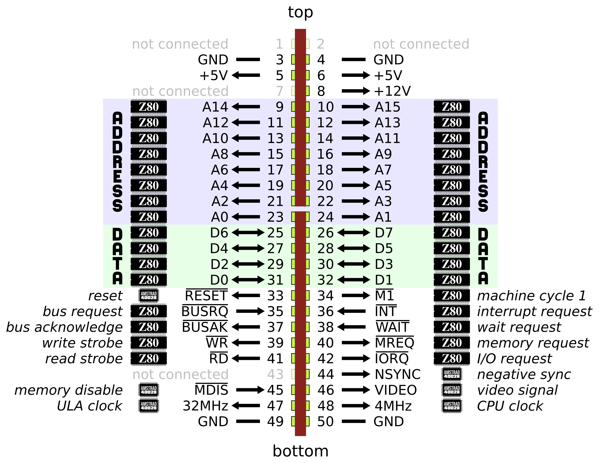

PCW expansion port pinout
=========================

The expansion port of the Amstrad PCW has the following characteristics :

- an expansion board cannot trigger a non-maskable interrupt (NMI), it is
  reserved to the floppy disc controller,
- 2 voltages are available : 5 volts and 12 volts,
- 4 pins are not connected,
- expansion boards can act as a memory controller (with the MDIS pin),
- expansion boards can take control of the bus thus allowing DMA,
- 2 clocks are available : 4 MHz and 32 MHz (32 MHz is the base clock of the
  PCW, the Z80 4 MHz and the 16 MHz pixel clock are derived from it),
- expansion boards can read the video signal,
- expansion boards can control the PCW monitor when the video controller is
  disabled,
- the Z80 refresh signal is not available,
- IO addresses are 8 bits wide (unlike the Amstrad CPC),
- IO addresses between 0x00 and 0x7F are reserved to the floppy disc controller.

