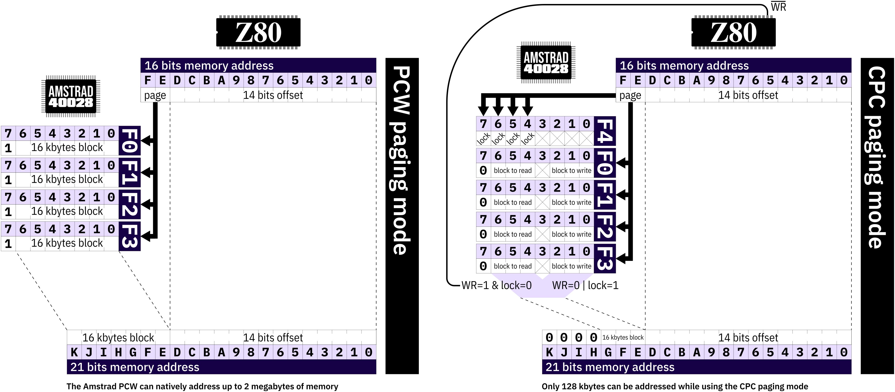

Amstrad PCW memory controller
=============================

The Amstrad PCW memory controller can natively address up to 2 megabytes of
memory.

It does so by using bank switching of 16 kilobytes blocks at 0x0000, 0x4000,
0x8000 and 0xC000.

It has two operation modes : PCW paging mode and CPC paging mode.

The two modes can be mixed.

PCW paging mode
---------------

It is the standard mode in which the PCW works.

The highest 2 bits of an address selects one of the four memory registers.
These registers selects a 16 kilobytes block among 128 (128 × 16k = 2048k).

CPC paging mode
---------------

Though this mode is fully functional and a bit more sophisticated than the
standard mode, there are several reasons why not use it :

- it only allows 128 kilobytes addresses,
- it is a vestige of a never produced machine meant to be the CPC successor,
- it could be incompatible with memory expansion boards (such a board must
listen to IO requests done to port 0xF0 to 0xF3 to give access to more than 64
kilobytes because the expansion port has only 16 bits addresses).

This mode allows to point to different blocks at the same address given access
mode (read or write).

The big picture
---------------

