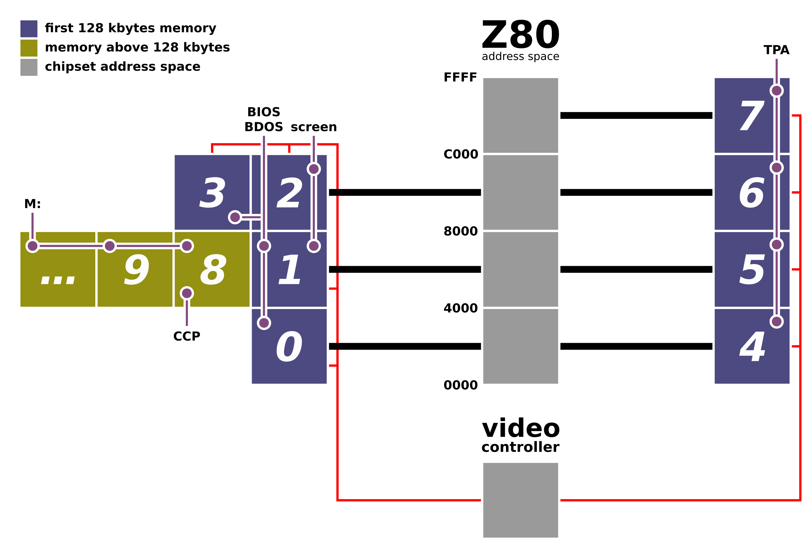
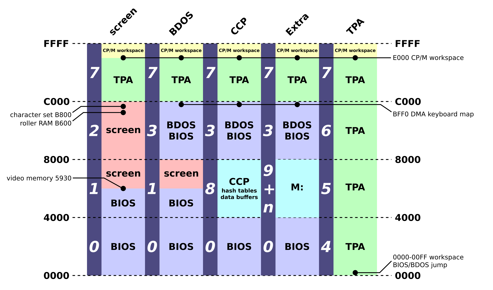

Memory map under CP/M+
======================

Bank switching
--------------

The Amstrad PCW uses the Z80 microprocessor and the CP/M+ operating system.

This implies it has memory limitations as a Z80 address space is 16 bits wide.
It can not address more than 64 kilobytes on its own.

As a lot of 8 bits computers, the Amstrad PCW uses bank switching to allow more
memory to be accessed. A special chipset sits between the CPU and the memory and
decides which portion of the memory the CPU will see.

On the Amstrad PCW, the memory is divided into blocks of 16 kilobytes. The PCW
can handle up to 2 megabytes (128×16 kilobytes banks).

The 128 first kilobytes (the first 8 banks) are special:

- the video controller can only use these banks for the video memory and the
  roller RAM,
- a special mode (CPC or standard paging mode) exists that can differenciate
  reads and writes to these banks.

Normally, a read or write at the same address, from the CPU point of view,
accesses the same byte. In CPC paging mode, you can read from bank 0 and write
to bank 1 when accessing byte at 0x0123 address.

The CPC paging mode is not used in the PCW because it is limited to the first
128 kilobytes of memory.

Bank mapping under CP/M+
------------------------

The banks under CP/M+ in the Amstrad PCW are always mapped at the same base
address, but not at the same time.

Memory environments
-------------------

Bank configurations are organised under memory environments.

The TPA is the environment a program sees when it is executed under CP/M+.

