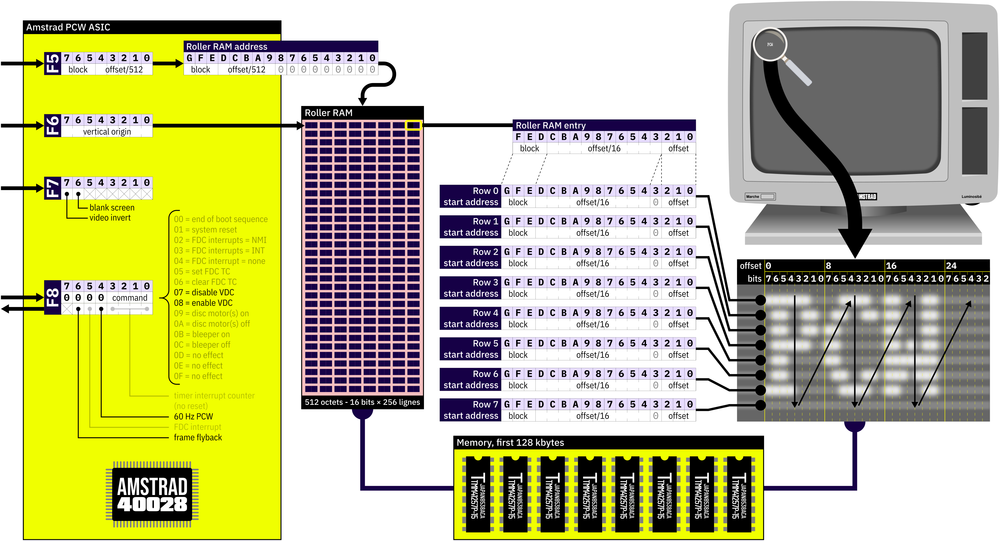
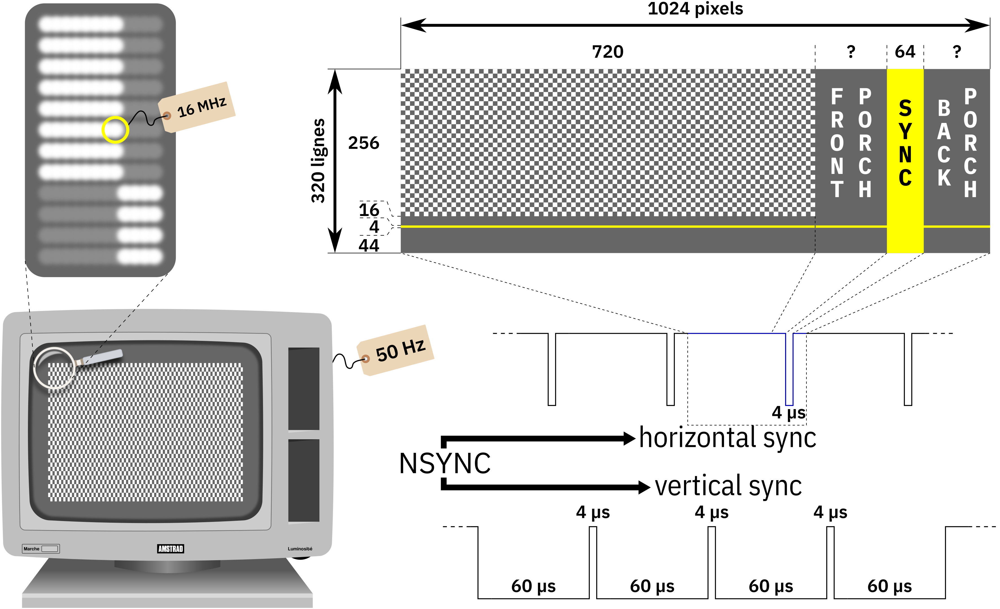

Amstrad PCW video memory and controller
=======================================

The PCW video controller
------------------------

The Amstrad PCW video controller is quite simple but it can lead to interesting
effects or performance if correctly programmed.

There are only four registers that control the video controller. They are
accessible on ports 0xF, 0xF6, 0xF7 and 0xF8.

You cannot tweak it like you could tweak the MC6845 for exemple (the video
signals are hardwired).

Nonetheless it uses a roller RAM. It is a small table containing 256 entries,
one for each line displayed on the screen. It allows to specify where the pixels
of the line should be found in the memory. What needs to be achieved with
careful timing and interrupts on the Amstrad CPC can be done by putting the
correct value in this table.

This video controller is nothing than a frame buffer but it offers some tricks
to allow “fast” drawing of characters : the controller reads memory with a step
of 8. The first 8 pixels are read at offset 0, the next 8 pixels are read at
offset 8 etc. Combined with a cleverly configured roller RAM, drawing a
character consists of copying 8 contiguous bytes.

Vertical smooth scrolling can easily be achieved by the selecting the first
entry to be read by the video controller with the 0xF6 port. When the end of
the roller RAM is reached, it goes back to the start.

Horizontal smooth scrolling is not achievable with hardware because the roller
RAM only allows an offset of 16 pixels per line (this is a result of the video
controller being able to address 128 kilobytes of memory).

The PCW image
-------------

A PCW image is composed of 720×256 pixels in black and white. This allows a
90×32 text mode using an 8×8 character set.

Due to screen limitations, horizontally separating two white pixels with a
black pixel gives a half bright pattern (720 pixels are a bit too much for this
screen technology).

Space between vertical pixels is greater than space between horizontal pixels.
Though a pixel is physically a perfect dot, they must be considered as twice
taller than wide when programming.

The PCW video signal
--------------------

THe PCW screen works natively at 50 Hz using a pixel clock of 16 MHz (half of
the PCW base clock).

The video controller can be disabled using command 0x07 on port 0xF8. The screen
must then be directly controlled by an expansion board.

